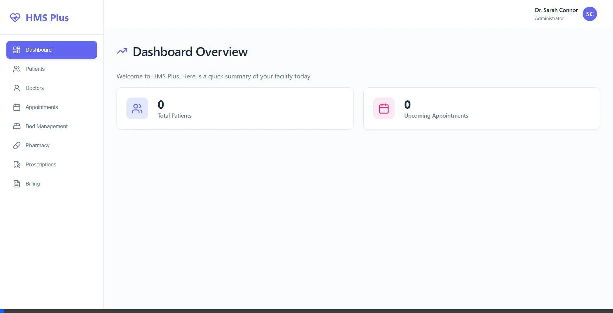

# Hospital Management System (HMS) Plus 🏥

A fully featured, modern Hospital Management System built for college projects and scalable deployments.

[](https://dashboard.render.com/) *(Update this link to your Render URL!)*

## 🚀 Features

- **Dashboard**: Real-time analytics of hospital operations.
- **Patient Management**: Register, track, and manage patient records.
- **Doctor Directory**: Maintain doctor details and specialties.
- **Appointment Scheduling**: Book and track appointments seamlessly.
- **Bed & Ward Management**: Real-time tracking of general, ICU, and private bed availability.
- **Pharmacy Inventory**: Monitor medicine stock and prices.
- **Digital Prescriptions**: Issue and manage patient prescriptions digitally.
- **Billing System**: Generate invoices and track payment statuses.

## 🎥 Application Demo



## 🛠️ Tech Stack

- **Frontend**: React.js, Vite, Vanilla CSS (Custom Design System), Lucide-React
- **Backend**: Java 17, Spring Boot, Spring Data JPA, Spring WebMVC
- **Database**: H2 In-Memory Database
- **Deployment**: Docker, Multi-stage builds

## 📦 How to Run Locally

### Using Docker (Recommended)
Make sure you have Docker installed.

```bash
# Clone the repository
git clone https://github.com/Arnob07Mondal/hospital-management-system.git
cd hospital-management-system

# Build and run using Docker Compose
docker-compose up --build
```
The application will be accessible at `http://localhost:8080`.

### Manual Build
Requires Java 17+ and Node.js 18+.

```bash
# Clone the repository
git clone https://github.com/Arnob07Mondal/hospital-management-system.git
cd hospital-management-system

# Build the React frontend
cd frontend
npm install
npm run build

# Build and run the Spring Boot backend
cd ../backend
./gradlew bootRun
```
The application will be accessible at `http://localhost:8080`.

---
*Developed for academic presentation and rapid prototyping.*
